# Initial Project Setup (rust/example01)

This example covers installing everything you need for creating and running a basic "Hello World" application on iOS. It assumes you have Xcode already installed. Follow along with the source [here](https://github.com/mtak-/rust-on-mobile/tree/master/rust/example01). Not every step is required, and some of it just my personal preferences on how to setup the project. It's likely that `AppCode` is a good alternative to Xcode for writing rust on iOS.

## Installing dependencies

If you haven't already, install rust.
```sh
$ curl https://sh.rustup.rs -sSf | sh
$ rustup update
```

This tutorial was written using the nightly toolchain and the rust 2018 edition (but doesn't really require nightly):
```sh
$ rustup install nightly
$ rustup default nightly
```

These components are pretty useful:
```sh
$ rustup component add \
    rls-preview \ # rust language server
    rust-analysis \ # helper for rls
    rust-src \ # source code for std
    rustfmt-preview # whitespace formatting
```

Some VSCode plugins:
* [rust (rls)](https://marketplace.visualstudio.com/items?itemName=rust-lang.rust) for rls integration
* [crates](https://marketplace.visualstudio.com/items?itemName=serayuzgur.crates) for dependency version checking
* [search crates.io](https://marketplace.visualstudio.com/items?itemName=belfz.search-crates-io)

This VSCode workspace setting will set rls to build for aarch64-apple-ios by default:
```json
{ "rust.target": "aarch64-apple-ios" }
```

For iOS these toolchains should be added:
```sh
$ rustup target add \
    aarch64-apple-ios \
    armv7-apple-ios \
    armv7s-apple-ios \
    x86_64-apple-ios \
    i386-apple-ios
```
When building for iOS, you can specify one of these toolchains using a command like `cargo build --target aarch64-apple-ios`

Additionally we'll use cbindgen to automate the ObjectiveC/C++ to rust FFI.

```sh
$ cargo install cbindgen
```

`cbindgen` will parse a crate and generate a C/C++ header that can be used to call directly into that crate from C or C++! That's cooler than a... a vampire's demeanor.

Finally the [`rust-xcode-plugin`](https://github.com/mtak-/rust-xcode-plugin) will give some syntax highlighting, but more importantly it'll enable setting breakpoints in rust code via the GUI. See that project for installation instructions.

## Setting up the rust workspace

First create the root project folder.

```sh
$ mkdir YOUR_PROJECT_NAME && cd YOUR_PROJECT_NAME
$ git init .
```

Now let's create a Cargo.toml in the root folder:
```toml
[workspace]
members = [
    # all the rust crate paths will be listed here
]
```
This sets up a [cargo workspace](https://doc.rust-lang.org/book/second-edition/ch14-03-cargo-workspaces.html) that can be used to enable things like `lto` across all subprojects built with the `--release` flag. Considering the current state of rust on iOS, at some point you'll wanna fork some repository to fix a bug and have to use a [`patch`](https://doc.rust-lang.org/cargo/reference/manifest.html#the-patch-section) or [`replace`](https://doc.rust-lang.org/cargo/reference/manifest.html#the-replace-section).

Next lets create two folders, one to contain all of the rust code, and one to contain the Xcode project.

```sh
$ mkdir ios
$ mkdir rust
$ cd rust
```

Inside the rust folder we'll create 3 new cargo projects:

* `app-lib` will contain almost all of the application code
* `app-bindings` will be the project [cbindgen](https://github.com/eqrion/cbindgen) uses to generate the ObjectiveC/C++-to-rust FFI.
* `app-bin` this is an optional convenience project for running your application on osx (using `cargo run`).

### app-lib
Create the app-lib project which will contain essentially all of your application code.
```sh
$ cargo new --lib app-lib
```

Add that project to the workspace by modifying the root `Cargo.toml`
```toml
[workspace]
members = [
    "rust/app-lib"
]
```

Put this code inside the newly created `lib.rs` file.
```rust
pub fn main_rs() -> std::os::raw::c_int {
    println!("Hello iOS!");
    0
}
```
`main_rs` will be the `main()` function of our application in spirit. Its return type is an integer compatible with `C`'s `int`. In practice this is always `i32`.

Moving along to the `cbindgen` project!

### app-bindings
This is the library that your xcode project will actually link to.
```sh
rust$ cargo new --lib app-bindings
```

Add it to the workspace the same way you did `app-lib`.

In the `Cargo.toml` add `app-lib` as a depedency
```toml
[dependencies.app-lib]
path = "../app-lib"
```

We want the project to be built into a `.a` file so that Xcode is able to link to it.
```toml
[lib]
crate-type = ["staticlib"] # generates a `.a` file
```

Stick this code in `lib.rs`
```rust
use std::{panic::{self, UnwindSafe}, process};

#[no_mangle]
pub extern "C" fn main_rs() -> std::os::raw::c_int {
    stop_unwind(app_lib::main_rs)
}

fn stop_unwind<F: FnOnce() -> T + UnwindSafe, T>(f: F) -> T {
    match panic::catch_unwind(f) {
        Ok(t) => t,
        Err(_) => {
            eprintln!("Attempt to Unwind out of rust code");
            process::abort()
        }
    }
}
```

That's a lot to unpack. `app_bindings::main_rs` will be called directly from ObjectiveC/C++ so we need to turn [name mangling](https://en.wikipedia.org/wiki/Name_mangling) off `#[no_mangle]`. Also important is to ensure the symbol visibility is not ["hidden"](https://gcc.gnu.org/wiki/Visibility) and uses the C ABI for function calls `pub extern "C"`.

Inside `main_rs` we want to call `app_lib::main_rs()`, but we don't want to unwind out of rust code into another language. That would be [undefined behavior](https://doc.rust-lang.org/nomicon/unwinding.html
). It's weird, _very weird_, that this is UB given that there's neither hide nor hair of `unsafe`, but... meh? The helper function `stop_unwind` is used to catch any panic, and convert that into a hard `process::abort()`.

### app-bin
This project is just to enable `cargo run -p app-bin` to work from the command line. It's a convenience so that we don't have to keep switching between IDEs (vscode/xcode). It will not (easily) work on iOS; moreover, it's much quicker to iterate on OSX than on iOS.

```sh
$ cargo new --bin app-bin
```

Add it to the workspace and then add app-lib as a dependency.
```toml
[dependencies.app-lib]
path = "../app-lib"
```

And stick this in `main.rs`
```rust
fn main() {
    assert_eq!(app_lib::main_rs(), 0);
}
```

We can now test our application to verify that it works.
```sh
$ cargo run -p app-bin
Finished dev [unoptimized + debuginfo] target(s) in 0.03s
Running `rust-on-mobile/target/debug/app-bin01`
Hello iOS!
```

## Setting up the Xcode Project

Create a new `Single View App` Xcode project in the `ios` folder.

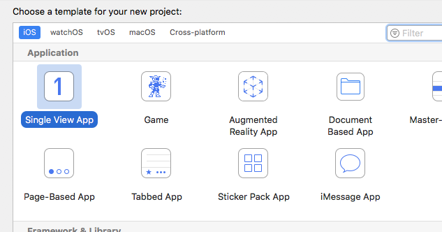

Be sure to set the language to `Objective C`.

Turn on the "Legacy Build System" (Xcode10 only). It is a bit more reliable (File -> Project Settings -> Legacy Build System):

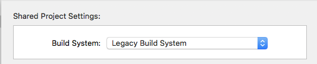

Now delete all the default files from your project except for `main.m` and `Info.plist`. Rename `main.m` to `main.mm` to use `ObjectiveC++`.

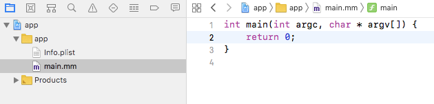

Inside `main()` change the code to just `return 0` for now. This will be where we call into `app_bindings::main_rs()`.

Now close out of Xcode. By default everything is wrapped up in a new folder, but it's slightly more convenient to just have everything flat in the iOS folder. So go ahead and fix that, and reopen the project.

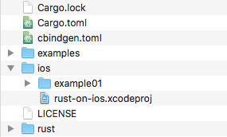

Drag and drop the rust code into your project and add it using "Create Folder References". While it's generally nicer to write rust in VSCode, sometimes it's useful to have the rust code in the xcode project for debugging and setting breakpoints.

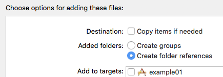

Finally, change the configuration names to lowercase instead capitalized (Debug => debug, Release => release).

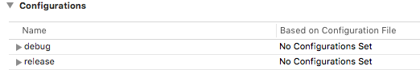

### cbindgen target

Create a new file called `cbindgen.toml` in the root directory and put this code in it.
```toml
autogen_warning = "/* Warning, this file is autogenerated by cbindgen. Don't modify this manually. */"
language = "C++"
namespace = "ffi"
include_guard = "CBINDGEN_BINDINGS_H"

[defines]
"target_os = ios" = "TARGET_OS_IOS"
"target_os = macos" = "TARGET_OS_MACOS"
```

This tells `cbindgen` how to generate the header from our rust code. Importantly the `defines` section will tell `cbindgen` what `#define`s to use when generating platform specific code. We won't have platform specific code in this tutorial, but it's super useful to know!

In Xcode go ahead and create a new Cross-platform External Build System target. Name it `cbindgen` and set the tool to `cbindgen` as well.


Setup the "Info" tab to look like this:

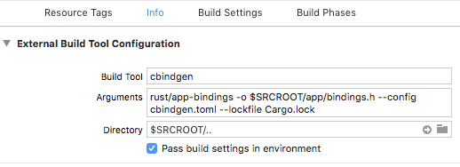

In the "Build Settings" tab add a `PATH` variable and give it this value (the leading colon is important).

```
:$HOME/.cargo/bin:$(inherited)
```

Alright, `cbindgen` should now work! Add it as a target dependency to your application and try to build your application.

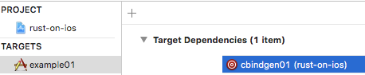

You should be able to include "bindings.h" from main now. Let's try!

```cpp
#include "bindings.h"

int main(int argc, char * argv[]) {
	return ffi::main_rs();
}
```

Now that the ObjectiveC++ to rust FFI is all setup the only thing left to do is to tell xcode how to build our rust code, and then link to it!

### cargo target

We're gonna need a script to help us run cargo with the appropriate `--target` set from xcode.

```sh
#!/bin/sh

# Iterate through the list of ARCHS and build each one
for ARCH in `echo $ARCHS`; do
    RUST_ARCH="${ARCH}-apple-ios"
    # iOS and rust differ on the name of this ARCH
    if [ "${ARCH}" = "arm64" ]; then
        RUST_ARCH="aarch64-apple-ios"
    fi

    # build in release mode if the configuration requests it
    if [ "${CONFIGURATION}" = "release" ]; then
        CONFIG="--release"
    fi
    COMMAND="cargo $@ ${CONFIG} --target ${RUST_ARCH}"
    echo $COMMAND
    $COMMAND
done
```

When an Xcode build gets kicked off, it fills in the `ARCHS` environment variable with all of the architectures it's trying to build. We need to convert that into a target triple that cargo will understand. Additionally it sets the `CONFIGURATION` environment variable to either `release` or `debug`, so we'll want to turn on the `--release` switch when appropriate.

This does not handle `lipo`ing multiple architectures into a single library. `cargo lipo` is a tool designed for that, but I haven't yet needed it.

In Xcode create a new External Build System target just like for `cbindgen`. Name it `cargo` and set the tool to `cargo_ios.sh`.

The info tab should look like this:

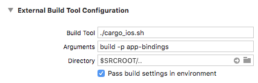

In the "Build Settings" tab add the `PATH` environment variable just like for `cbindgen`.

```
:$HOME/.cargo/bin:$(inherited)
```

Finally add `cargo` as a target dependency for your application just like for `cbindgen`.

### linking

We're ready to link our application to our rust `app_bindings.a` file!

To be sure we link to the correct architecture, we'll create some symlinks in the project root.

```sh
$ mkdir target-symlinks
$ cd target-symlinks
$ ln -s ../target/aarch64-apple-ios arm64
$ ln -s ../target/armv7s-apple-ios armv7s
$ ln -s ../target/armv7-apple-ios armv7
$ ln -s ../target/x86_64-apple-ios x86_64
$ ln -s ../target/i386-apple-ios i386
```

Back in the xcode project lets add all these directories to our `Library Search Paths` for our application with one cute line (does not work for release builds..):

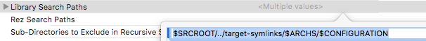

Lastly add `app_bindings.a` - any one in the target folder will do - to the "Link Binary With Libraries" section in "Build Phases"

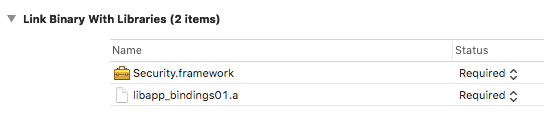

For some reason I also needed to add `Security.framework` to fix a linker error, YMMV.

## Conclusion

Now you should be able to build and run for device or simulator. If you setup the `rust-xcode-plugin` breakpoints and variable inspection etc should also work!

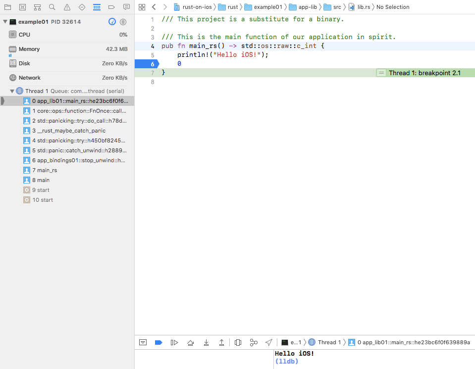

If you have any corrections or bug fixes for this example please file an issue or make a Pull Request.